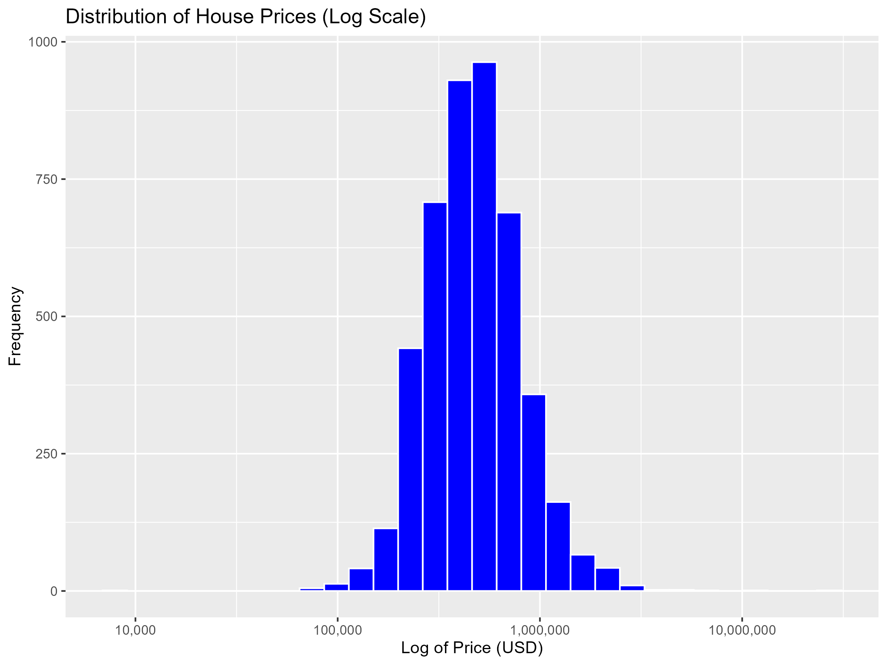
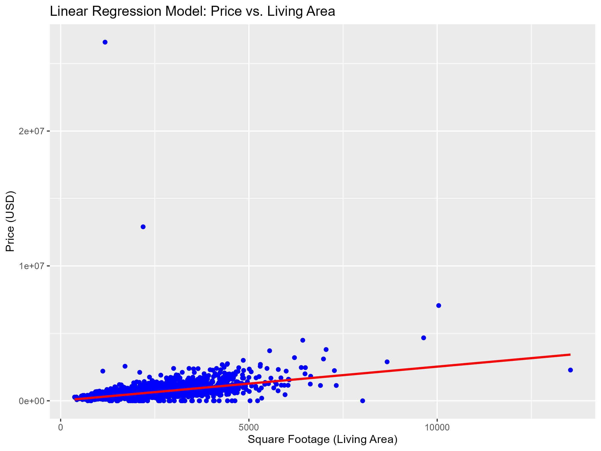
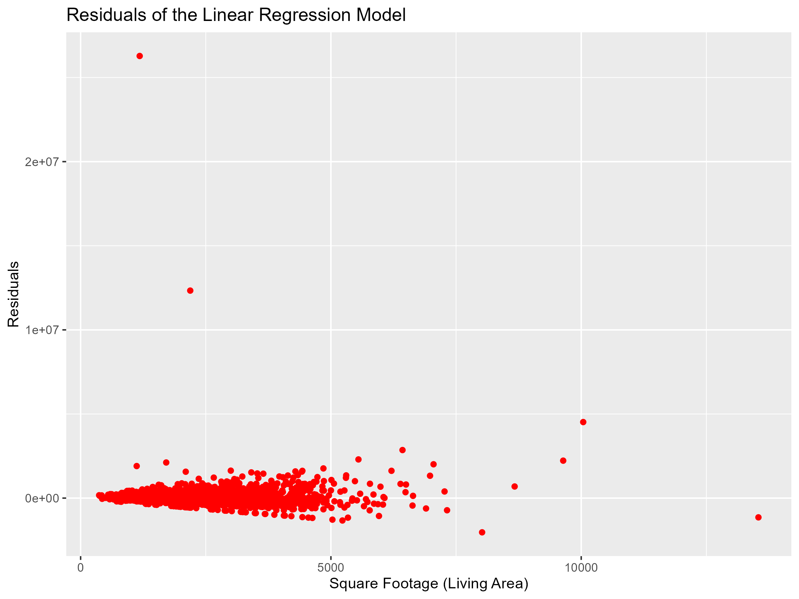
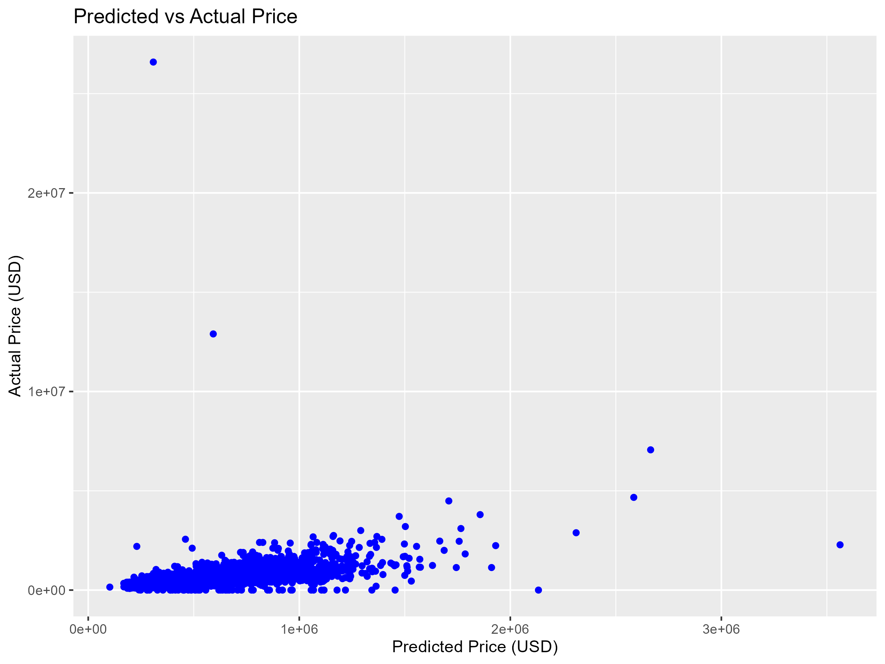

<style type="text/css">
/* General font size and layout adjustments */
body, div, h1, h2, h3, h4, h5, p {
  font-size: 14px;  /* Standard font size for text */
  line-height: 1.4; /* Ensure lines are spaced properly */
}

h1 {
  font-size: 30px;  /* Larger title font size */
  color: #8C1D40;  /* Title color */
  margin-top: 10px;  /* Add top margin to prevent title from being cut off */
  margin-bottom: 20px;  /* Space below the title for better visibility */
}

h2 {
  font-size: 24px;  /* Subheading font size */
  color: #4A90E2;
}

h3 {
  font-size: 20px;  /* Smaller subheading */
}

h4, h5 {
  font-size: 18px;  /* Further smaller subheadings */
}

p {
  font-size: 14px;  /* Paragraph text size */
}

code, pre {
  font-size: 12px;  /* Code block text size */
  white-space: pre-wrap;  /* Ensure long lines of code wrap to next line */
  word-wrap: break-word;
}

/* Adjust slide navigation arrows size */
.slidenav {
  font-size: 16px;  /* Navigation arrow font size */
}

/* Adjust slide container layout */
.slide {
  padding: 20px;  /* Increase padding around the content */
  margin: 0;
  height: 80vh;  /* Ensure slide height fits within the viewport */
  overflow: auto;  /* Allow scrolling for overflow content */
  text-align: left;  /* Left-align content */
  padding-top: 50px; /* Add more space at the top for titles */
  padding-bottom: 50px; /* Add space at the bottom to prevent content from touching the bottom */
}

/* Ensure that content within slides does not overflow */
.slide-content {
  max-width: 100%;
  overflow: auto;  /* Allow scrolling within content */
}

/* Make images and graphs fit well */
img, .plotly-graph-div, .ggplot {
  width: 75%;  /* Set image and plot width to 75% */
  height: auto;  /* Maintain aspect ratio */
  margin-left: auto;
  margin-right: auto;
}

/* Adjust plotly graph size */
.plotly-graph-div {
  max-width: 100%;
  height: 400px;  /* Set max height for Plotly graphs */
  margin: 0 auto;
}

/* Adjust ggplot image size */
.ggplot {
  max-width: 100%;
  height: 350px;  /* Set max height for ggplot images */
  margin: 0 auto;
}

/* Make sure math text doesn't overflow */
.math {
  font-size: 14px;  /* Math text font size */
}
</style>

## Introduction

- **Topic:** Simple Linear Regression
  - A powerful statistical method for modeling the relationship between two variables.
  - Commonly used for prediction and determining the strength of relationships.
- **Application:** Predicting house prices in the USA.
  - The real estate market is a key indicator of economic health.
  - Accurate predictions are essential for buyers, sellers, and policymakers.
- **Focus of This Presentation:**
  - Use **Simple Linear Regression** to understand and predict house prices based on key factors such as **size**, **number of bedrooms**, and **location**.


## Goal of the Presentation

- **Primary Objective**:
  - Explore how house prices in the USA are influenced by various factors.
  - Build a predictive model using Simple Linear Regression.

- **Why This Matters:**
  - Provides insights for smarter real estate decisions.
  - Demonstrates the practical application of statistical methods in finance.

- **How This Will Be Achieved:**
  - Analyzing house price data with visualization tools like **ggplot2** and **plotly**.
  - Using R code to model relationships and make predictions.
  - Explaining the results through statistical concepts and LaTeX math notations.


##  **Proceed to Exploratory Data Analysis**
The dataset is loaded,   creating visualizations like histograms or scatter plots. Us ggplot2 
```{r}
## Code for Distribution of House Prices


# Ensure the scales package is loaded
library(ggplot2)
library(scales)
house_data <- read.csv('data.csv')
# Create the plot 
plot <- ggplot(house_data, aes(x = price)) +
  geom_histogram(fill = "blue", color = "white", bins = 30) +
  scale_x_log10(labels = scales::comma) +  # Log scale on x-axis
  labs(
    title = "Distribution of House Prices (Log Scale)",
    x = "Log of Price (USD)",
    y = "Frequency"
  )

# Save the plot to a file (e.g., "house_price_distribution.png")
ggsave("house_price_distribution.png", plot = plot, width = 8, height = 6)
```

## Plot of House Prices Distribution



## Correlation between price and square footage
```{r}

# Scatter plot of price vs. square footage of living space
ggplot(house_data, aes(x = sqft_living, y = price)) +
  geom_point(color = "blue") +
  geom_smooth(method = "lm", color = "red", se = FALSE) +  # Adding linear regression line
  labs(
    title = "Relationship Between House Price and Living Area",
    x = "Square Footage (Living Area)",
    y = "Price (USD)"
  ) -> plot1

# Save the plot to a file
ggsave("price_vs_sqft_living.png", plot = plot1, width = 8, height = 6)
```


## The plot

## Simple Linear Regression (Price vs Living Area)


```{r}
# Fit a simple linear regression model
lm_model <- lm(price ~ sqft_living, data = house_data)

# Summarize the model
summary(lm_model)

# Plot the regression line
ggplot(house_data, aes(x = sqft_living, y = price)) +
  geom_point(color = "blue") +
  geom_smooth(method = "lm", color = "red", se = FALSE) +
  labs(
    title = "Linear Regression Model: Price vs. Living Area",
    x = "Square Footage (Living Area)",
    y = "Price (USD)"
  ) -> plot3

# Save the plot to a file
ggsave("price_vs_sqft_living_regression.png", plot = plot3, width = 8, height = 6)
```
## plot


## Residuals from the Linear Regression Model
```{r}
# Calculate and plot residuals of the linear regression model
house_data$residuals <- resid(lm_model)

ggplot(house_data, aes(x = sqft_living, y = residuals)) +
  geom_point(color = "red") +
  labs(
    title = "Residuals of the Linear Regression Model",
    x = "Square Footage (Living Area)",
    y = "Residuals"
  ) -> plot4

# Save the plot to a file
ggsave("regression_residuals.png", plot = plot4, width = 8, height = 6)
```
## Slide 8: Display the Saved Plot


## Multiple Linear Regression (Price Prediction)

```{r}
# Fit a multiple linear regression model using multiple predictors
lm_multiple <- lm(price ~ sqft_living + bedrooms + bathrooms, data = house_data)

# Summarize the model
summary(lm_multiple)

# Predictions from the multiple regression model
house_data$predicted_price <- predict(lm_multiple, newdata = house_data)

ggplot(house_data, aes(x = predicted_price, y = price)) +
  geom_point(color = "blue") +
  labs(
    title = "Predicted vs Actual Price",
    x = "Predicted Price (USD)",
    y = "Actual Price (USD)"
  ) -> plot5

# Save the plot to a file
ggsave("predicted_vs_actual_price.png", plot = plot5, width = 8, height = 6)
```
## Display the Saved Plot
